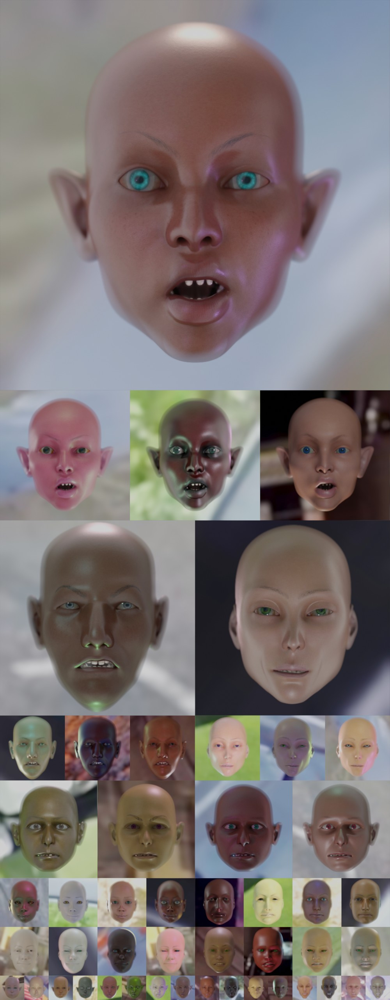

# Never-Seen-in-the-Wild Dataset (NSEEWI)
### Synthetic Datasets as Means of Examining Carry Over Biases Across Computational Disciplines

Never Seen in the Wild is the outcome of a generative system devised to perpetually output humanoid faces. Using a fully parameterized 3D model, paired with modular shaders, the system is capable of producing infinite facial variations. The parametrized model is an aggregate of the most downloaded human models scraped from the web. In this way, it carries with it biases, assumptions, and engineered features that are perpetually replicated in the production and consumption of 3D human models. The availability and ease of use of such 3D models bring to question the veracity and accuracy of their creation and inherent biases; especially when utilized in the production and application of technologies that directly interact with the public: surveillance, facial recognition, and generative imaging. As such, Never Seen in the Wild is intended to operate as an ever-expanding dataset of synthetic faces to examine how biases carry over across different computational disciplines, and to spark a conversation on the means of inclusion and representational diversity in predictive models and their inescapable partiality.

At its current state, Never Seen in the Wild is comprised of 100,000 high-quality images with considerable variations in age, image background, and facial features. It consists of 25,000 unique humanoids with four variations in facial features, lighting, and background per individual. Every image is accompanied by 264 facial landmarks and occlusion annotations, camera metadata, and an 800-dimensional vector of the 3D model and shader parameters. Nevertheless, every data point is an assemblage of invisible prejudices made by the system and the makers of its source data.

Further reading:
* [Abnormal Encephalization in the Age of Machine Learning](https://www.e-flux.com/journal/75/67133/abnormal-encephalization-in-the-age-of-machine-learning/)
* [Invisible Images (Your Pictures Are Looking at You)](https://thenewinquiry.com/invisible-images-your-pictures-are-looking-at-you/)
* [Reprogramming Decisionism](https://www.e-flux.com/journal/85/155472/reprogramming-decisionism/)
* [Reimagining Networks](https://thenewinquiry.com/reimagining-networks/)
* [Excavating AI](https://www.excavating.ai/)
